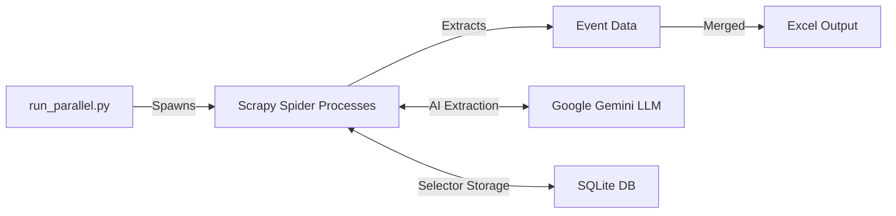

# Event Automation Project - Technical Logic Overview

## Project Purpose

This project automates the extraction of event data from multiple Swedish cultural institution websites into a unified Excel spreadsheet. It combines **web scraping** with **AI-powered data extraction** to handle diverse website structures.

---

## Core Architecture



### Key Components

| Component | File | Purpose |
|-----------|------|---------|
| **Parallel Runner** | `run_parallel.py` | Orchestrates concurrent spider execution across multiple URLs |
| **Universal Spider** | `spiders/universal_spider.py` | Single spider handling all websites with site-specific logic |
| **Data Pipeline** | `pipelines.py` | Sorts events by date and exports to Excel |
| **Item Schema** | `items.py` | Defines the 13-field event data structure |

---

## Extraction Logic

### 1. Multi-Site Strategy

The spider uses a **URL-based routing pattern**:

- **Stockholm Library** (`biblioteket.stockholm.se`): Uses Playwright to click "Load More" buttons repeatedly, then applies hardcoded CSS selectors
- **Skansen** (`skansen.se`): Day-by-day calendar navigation for 30 days, buffering events to consolidate recurring events with date ranges
- **Tekniska Museet**: Uses `cloudscraper` to bypass Cloudflare protection, then parses with BeautifulSoup

### 2. Hybrid Extraction (Fast Path + AI Fallback)

```
For each website:
  1. Try FAST PATH → Use CSS selectors from SQLite DB
  2. If fails → FALLBACK to Gemini LLM extraction
  3. Store discovered selectors for future runs
```

### 3. AI-Powered Extraction (Gemini LLM)

When selectors fail or aren't available, the spider sends page content to **Google Gemini 2.5 Pro**:

- Extracts: `event_name`, `date_iso`, `time`, `location`, `target_group`, `description`, `status`
- Handles Swedish date formats (e.g., "25 december" → "2025-12-25")
- Detects cancelled events via keywords ("Inställt", "Fullbokat")
- Preserves original Swedish text (no translation)

---

## Data Processing Pipeline

### Field Normalization

| Raw Data | Normalized Output |
|----------|-------------------|
| Swedish dates ("25 dec") | ISO format (`2025-12-25`) |
| Age patterns ("för 3-6 år") | Category (`children`) |
| Booking text ("Boka plats") | Status (`Requires booking`) |
| Event titles with locations | Extracted venue name |

### Status Detection

Events are automatically classified as:
- `scheduled` - Normal event
- `cancelled` - Contains "Inställt", "Cancelled"
- `fullbokat` - Fully booked

---

## Parallel Execution Model

```python
# run_parallel.py uses ProcessPoolExecutor
with ProcessPoolExecutor(max_workers=2) as executor:
    # Each URL runs as independent subprocess
    # Outputs merged via JSON → deduplicated → Excel
```

**Benefits:**
- Isolates Playwright browser contexts
- Prevents rate-limiting through distributed requests
- Deduplicates events by `(name, date, time)` tuple

---

## Output Schema

The final Excel contains these columns:

| Column | Description |
|--------|-------------|
| Event Name | Title of the event |
| Date / Date ISO | Human-readable and ISO format dates |
| End Date ISO | For multi-day events |
| Time | Event time or "N/A" |
| Location | Venue extracted from selectors or title |
| Target Group | Raw audience info |
| Status | `scheduled`, `cancelled`, or `fullbokat` |
| Booking Info | `Requires booking`, `Drop-in`, or `N/A` |
| Description | Event teaser (max 500 chars) |
| Event URL | Direct link to event page |

---

## Technology Stack

- **Scrapy** - Web crawling framework
- **Playwright** - Browser automation for JavaScript-rendered content
- **Google Gemini 2.5 Pro** - Advanced thinking model for intelligent data extraction
- **BeautifulSoup + Cloudscraper** - Cloudflare bypass for protected sites
- **Pandas + OpenPyXL** - Data manipulation and Excel export
- **SQLite** - Persistent selector storage
